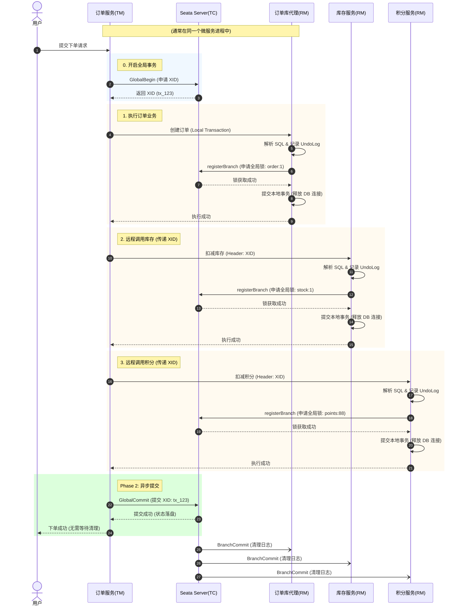

# Java 架构师学习笔记：分布式事务与一致性架构

**日期**: 2026-01-10
**主题**: Zookeeper 架构、分布式锁 & Seata 分布式事务原理
**状态**: ✅ 已完成

## 🧠 核心知识点回顾

### 1. Zookeeper 与 分布式锁 (CP 架构)
- **定位**: 保证强一致性 (CP)，Leader 选举期间不可用。
- **分布式锁原理**:
  - 利用 **临时顺序节点 + Watcher** 实现。
  - **优势**: 避免 Redis 的自旋锁 (Spin Lock) CPU 消耗，监听机制实现“公平锁”和“链式唤醒”，Session 断开自动释放锁（无死锁）。
  - **劣势**: 写性能不如 Redis，适用于对数据严谨性要求极高的场景。

### 2. Seata AT 模式深度解剖 (核心)
- **设计哲学**: **“快速释放本地锁”**。利用 Undo Log 和 全局锁实现逻辑回滚，换取高吞吐量。
- **两阶段流程**:
  - **Phase 1**: 解析 SQL -> 查前镜像 -> 执行业务 -> 查后镜像 -> 记 Undo Log -> **注册分支申请全局锁** -> 提交本地事务。
  - **Phase 2 (Commit)**: 极速返回成功 -> 异步删除 Undo Log。
  - **Phase 2 (Rollback)**: 查当前数据做脏写校验 -> 根据前镜像生成反向 SQL -> 恢复数据。
- **全局锁 (Global Lock)**:
  - **粒度**: 表名 + 主键。
  - **作用**: 即使本地 DB 锁已释放，TC 端的全局锁能拦截其他 Seata 事务的写操作，实现 **“读未提交(物理) + 写隔离(逻辑)”**。
- **XID 机制**:
  - **产生时机**: **TM 开启事务时**（进入 `@GlobalTransactional` 方法前）。
  - **传递**: 通过 RPC/HTTP Header 自上而下透传。

### 3. 分布式一致性解决方案分级 (架构师视角)
| 场景 | 推荐方案 | 核心理由 |
| :--- | :--- | :--- |
| **核心交易 (强一致)** | **Seata TCC** | 资金/库存扣减。性能高，无长锁，但开发成本高。 |
| **通用业务 (常规)** | **Seata AT** | OA/ERP/普通下单。零侵入开发，性能适中。 |
| **附带业务 (最终一致)** | **本地消息表 + MQ** | **送积分/发券/通知**。利用本地事务原子性写入任务，异步调度发 MQ。**用户体验最好**（成功才发，无回滚脏数据）。 |

### 4. 常见问题与避坑
- **脏读现象**: Seata AT 默认允许普通查询读到中间状态。解法：`@GlobalLock` + `FOR UPDATE` (技术解) 或 引入“冻结中”状态 (业务解)。
- **长事务**: 避免在 `@GlobalTransactional` 中进行 RPC/Http 耗时调用，防止长时间占用全局锁。
- **调用顺序**: 严格统一资源调用顺序（如先扣库存后扣积分）以防止死锁。

## 🎨 标准架构图 (Seata AT 下单流程)
